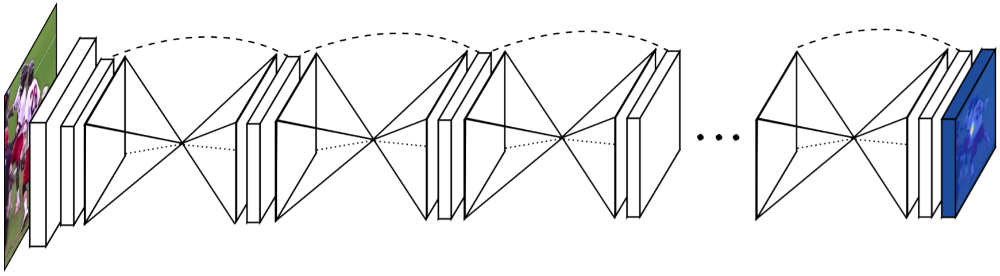

# Human Pose Estimation using Stacked Hourglass Network
The repository implements the [Stacked Hourglass Networks for Human Pose Estimation](https://arxiv.org/pdf/1603.06937.pdf) 
paper and provides an easy-to-follow mechanism for performing network pruning.



## Environment Setup
Follow the following steps to prepare the environment for training and evaluation.

1. Download the dataset from the [link](http://human-pose.mpi-inf.mpg.de/#download) and extract the images in a directory (let's say "./data/images").
1. Conda environment is recommended. Please follow the following steps to create environment and install the dependencies.
    1. Create new conda environment `conda create --name=hg python=3.8`.
    1. Activate newly created environment `conda activate hg`.
    1. Install dependencies `pip install -r requirements.txt`.

## Usage
The repository contains scripts `train_mpii.py` and `evaluate_mpii.py` for training and evaluate hourglass network 
on MPII dataset.

## Command Line Parameters
The below table lists the command line parameters available for `train_mpii.py` and `evaluate_mpii.py` scripts.

### `train_mpii.py`

| Parameter | Description  | Possible Values |
| ------------- | ------------- | ------------- |
| --image-path  | Path to directory containing training images. | string: path to dataset |
| --arch  | Model architecture, specifically the number of stacked hourglasses. | string: hg1, hg2, hg3, hg4, hg5, hg6, hg7, hg8 |
| --input_shape | Input shape of the model. Given as: (H, W). | tuple: (256, 256), etc. |
| --workers | Number of dataloader workers. | int: any integer value, e.g. 4, 16, etc. |
| --epochs  | Number of training epochs. | int: any integer value, e.g. 20, 50, etc. |
| --resume | Path to the latest checkpoints to resume training. | string: path to checkpoints |
| --start-epoch  | Start epoch number when resuming the training. | int: any integer value, e.g. 17, 47, etc. |
| --train-batch | Training batch size. | int: any integer value, e.g. 16, 24, etc. |
| --test-batch | Testing/Validation batch size. | int: any integer value, e.g. 1, 2, etc. |
| --lr | Learning rate for training. | float: any float value, e.g. 0.001, 0.00025, etc. |
| --momentum' | Momentum parameter for the optimizer. | float: any float value, e.g. 0.0, 0.9, etc. |
| --weight-decay  | Weight decay parameter for the optimizer. | float: any float value, e.g. 0.001, 0.0001, etc. |
| --schedule  | List of epochs where to decrease the learning rate. | List of integers: [20, 35, 45], [100, 150], etc. |
| --gamma | Learning rate is multiplied by gamma on schedule epochs. | float: any float value, e.g. 0.1, 0.02, etc. |
| --checkpoint  | Directory path to save the checkpoints. | string: path to checkpoints |
| --snapshot | Save models for every #snapshot epochs. | int: any integer value, e.g. 0, 1, etc. |
| --N | No. of channels in earlier layers of Residual Block. | int: any integer value, e.g. 64, 128, etc. |
| --M | No. of channels in the final layer of Residual Block. | int: any integer value, e.g. 128, 256, etc. |

### `evaluate_mpii.py`

| Parameter | Description  | Possible Values |
| ------------- | ------------- | ------------- |
| --image-path  | Path to directory containing training images. | string: path to dataset |
| --arch  | Model architecture, specifically the number of stacked hourglasses. | string: hg1, hg2, hg3, hg4, hg5, hg6, hg7, hg8 |
| --model-file | Path to the saved model checkpoints. | string: path to saved weights |
| --workers | Number of dataloader workers. | int: any integer value, e.g. 4, 16, etc. |
| --batch-size | Testing/Validation batch size. | int: any integer value, e.g. 1, 2, etc. |
| --visualize  | Either to save the qualitative results or not. | bool: True, False |
| --visualization_path | Directory path to save the visualizations. | string: path to save visualizations. |
| --N | No. of channels in earlier layers of Residual Block. | int: any integer value, e.g. 64, 128, etc. |
| --M | No. of channels in the final layer of Residual Block. | int: any integer value, e.g. 128, 256, etc. |

## Training
The script `train_mpii.py` is used for training. A sample training command to run training for `hg7` is given below. 
Adjust the number of workers as per the number of available CPU cores.

```bash
$ python train_mpii.py \
    --arch=hg7 \
    --image-path=./data/images \
    --checkpoint=checkpoints/hg8 \
    --epochs=50 \
    --train-batch=24 \
    --test-batch=24 \
    --lr=1e-3 \
    --schedule 20 35 45 \
    --workers=16 \
    --N=128 \
    --M=256
```

## Evaluation
The script `evaluate_mpii.py` is used for evaluation on validation dataset. A sample command to evaluate trained `hg7` mdoel is given below. 
Adjust the number of workers as per the number of available CPU cores.

```bash
$ python train_mpii.py \
    --arch=hg7 \
    --image-path=./data/images \
    --model-file=checkpoints/hg8/model_best.pth.tar \
    --batch-size=1 \
    --workers=16 \
    --visualize True \
    --visualization_path=./hg7_qualitative_results \
    --N=128 \
    --M=256
````

## Pretrained Models
Our pretrained models and compiled results can be found 
[here](https://mbzuaiac-my.sharepoint.com/:f:/g/personal/20020063_mbzuai_ac_ae/EokAQGIkxuJCvwEQ6JhR3ZwBLgMpmCLWbzcgiqrKomzEhQ?e=Ktov0h). 
The technical report on the analysis of the results will be updated soon on the same link.

## Results
The figure below shows some qualitative results of our pruned `hg7` model.


## Credits
The repository has been forked from [anibali/pytorch-stacked-hourglass](https://github.com/anibali/pytorch-stacked-hourglass) and modified to perform Network Pruning. 